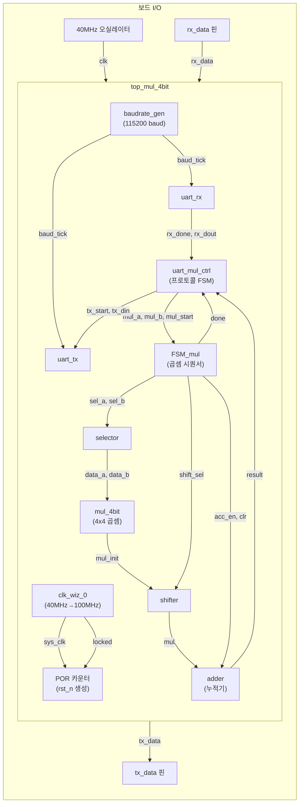

# mul_4bit_uart 아키텍처 문서

UART로 8비트 피연산자 두 개(`a`, `b`)를 ASCII hex 텍스트로 받아, 4비트 청크 단위 롱 멀티플리케이션(long multiplication)으로 16비트 곱을 계산하고, 결과를 다시 ASCII hex 텍스트로 UART에 돌려주는 FPGA 설계입니다.

- **타깃 보드**: Ultra96 (Xilinx Zynq UltraScale+ MPSoC, `xczu3eg-sbva484-1-e`)
- **Top 모듈**: `top_mul_4bit`
- **Vivado 버전**: 2023.2
- **개발 흐름**: 터미널 프로그램(picocom 등)으로 UART 콘솔에 hex 문자열을 입력하면 연산 결과를 되돌려받는 방식으로 검증

> 이 문서는 실제로 synth/impl까지 수행되어 보드에 구현된 소스 트리인
> `mul_4bit_uart/mul_4bit_uart.srcs/sources_1/imports/project_4bit_mul.srcs/sources_1/new/`
> 기준으로 작성되었습니다. (참고: git-tracked 원본인 `project_4bit_mul/`에는 top 포트에 `a/b/start/result/done`이 남아있고 raw binary UART 프로토콜을 쓰는 구조적으로 다른 버전이 별도로 존재합니다. 이 문서에서는 다루지 않습니다.)

---

## 1. 전체 블록 다이어그램



전체 흐름: `rx_data → uart_rx → uart_mul_ctrl(파싱) → FSM_mul/selector/mul_4bit/shifter/adder(연산) → uart_mul_ctrl(포맷팅) → uart_tx → tx_data`

`a/b/start/result/done`은 아직 실제 스위치/LED 핀에 연결하지 않았기 때문에 top 포트에서 제외되어 있으며, `uart_mul_ctrl`이 전적으로 곱셈기 코어를 구동합니다 (mux 없음).

### 1.1 단순화된 블록 다이어그램 (컨테인먼트 뷰)

위 mermaid 다이어그램은 신호명까지 보여주는 상세판이고, 아래는 "어떤 블록이 `top_mul_4bit` 안에 포함되어 있고, 어떤 블록과 연결되는지"만 선 하나로 단순화한 버전입니다 (개별 신호선/신호명은 생략).

<div style="overflow-x:auto;">
<svg width="1000" height="560" viewBox="0 0 1000 560" xmlns="http://www.w3.org/2000/svg" style="max-width:100%;height:auto;">
  <rect width="1000" height="560" fill="#fafafa"/>
  <defs>
    <marker id="arrow" viewBox="0 0 10 10" refX="9" refY="5" markerWidth="7" markerHeight="7" orient="auto-start-reverse">
      <path d="M0,0 L10,5 L0,10 z" fill="#444"/>
    </marker>
  </defs>

  <!-- top_mul_4bit 경계 -->
  <rect x="80" y="55" width="840" height="470" rx="10" fill="none" stroke="#666" stroke-dasharray="8,5" stroke-width="2"/>
  <text x="95" y="45" font-size="15" fill="#333" font-weight="bold">top_mul_4bit (top 모듈)</text>

  <!-- 외부 핀 -->
  <rect x="430" y="10" width="100" height="28" rx="6" fill="#fff" stroke="#333" stroke-width="1.5"/>
  <text x="480" y="28" font-size="13" fill="#333" text-anchor="middle">clk (40MHz)</text>

  <rect x="10" y="231" width="80" height="28" rx="6" fill="#fff" stroke="#333" stroke-width="1.5"/>
  <text x="50" y="249" font-size="13" fill="#333" text-anchor="middle">rx_data 핀</text>

  <rect x="910" y="231" width="80" height="28" rx="6" fill="#fff" stroke="#333" stroke-width="1.5"/>
  <text x="950" y="249" font-size="13" fill="#333" text-anchor="middle">tx_data 핀</text>

  <!-- 클럭/리셋 -->
  <rect x="380" y="65" width="220" height="40" rx="8" fill="#eef4ff" stroke="#3366aa" stroke-width="1.5"/>
  <text x="490" y="90" font-size="13" fill="#223" text-anchor="middle">클럭/리셋 생성</text>
  <text x="490" y="118" font-size="11" fill="#667" text-anchor="middle" font-style="italic">(sys_clk, rst_n → 전체 서브모듈 공급)</text>

  <!-- baudrate_gen -->
  <rect x="400" y="155" width="200" height="40" rx="8" fill="#eef4ff" stroke="#3366aa" stroke-width="1.5"/>
  <text x="500" y="180" font-size="13" fill="#223" text-anchor="middle">baudrate_gen</text>

  <!-- 메인 행 -->
  <rect x="100" y="215" width="170" height="65" rx="8" fill="#fff7e6" stroke="#c98a1b" stroke-width="1.5"/>
  <text x="185" y="252" font-size="13" fill="#332" text-anchor="middle">uart_rx</text>

  <rect x="400" y="215" width="200" height="65" rx="8" fill="#ffeef0" stroke="#c23b4f" stroke-width="1.5"/>
  <text x="500" y="252" font-size="13" fill="#322" text-anchor="middle">uart_mul_ctrl</text>

  <rect x="730" y="215" width="170" height="65" rx="8" fill="#fff7e6" stroke="#c98a1b" stroke-width="1.5"/>
  <text x="815" y="252" font-size="13" fill="#332" text-anchor="middle">uart_tx</text>

  <!-- 곱셈 데이터패스 (컨테이너) -->
  <rect x="380" y="330" width="240" height="170" rx="8" fill="#eefaf0" stroke="#2e8b57" stroke-width="1.5"/>
  <text x="500" y="352" font-size="13" fill="#153" text-anchor="middle" font-weight="bold">곱셈 데이터패스</text>
  <text x="500" y="375" font-size="11" fill="#254" text-anchor="middle">FSM_mul</text>
  <text x="500" y="393" font-size="11" fill="#254" text-anchor="middle">selector</text>
  <text x="500" y="411" font-size="11" fill="#254" text-anchor="middle">mul_4bit</text>
  <text x="500" y="429" font-size="11" fill="#254" text-anchor="middle">shifter</text>
  <text x="500" y="447" font-size="11" fill="#254" text-anchor="middle">adder</text>

  <!-- 연결선 (블록당 하나) -->
  <line x1="480" y1="38" x2="486" y2="65" stroke="#444" stroke-width="1.8" marker-end="url(#arrow)"/>
  <line x1="400" y1="105" x2="150" y2="215" stroke="#3366aa" stroke-width="1.3" stroke-dasharray="4,3" marker-end="url(#arrow)"/>
  <line x1="440" y1="195" x2="220" y2="215" stroke="#c98a1b" stroke-width="1.6" marker-end="url(#arrow)"/>
  <line x1="560" y1="195" x2="780" y2="215" stroke="#c98a1b" stroke-width="1.6" marker-end="url(#arrow)"/>
  <line x1="90" y1="245" x2="100" y2="247" stroke="#444" stroke-width="1.8" marker-end="url(#arrow)"/>
  <line x1="270" y1="247" x2="400" y2="247" stroke="#444" stroke-width="1.8" marker-end="url(#arrow)"/>
  <line x1="600" y1="247" x2="730" y2="247" stroke="#c23b4f" stroke-width="1.8" marker-start="url(#arrow)" marker-end="url(#arrow)"/>
  <line x1="500" y1="280" x2="500" y2="330" stroke="#c23b4f" stroke-width="1.8" marker-start="url(#arrow)" marker-end="url(#arrow)"/>
  <line x1="900" y1="247" x2="910" y2="245" stroke="#444" stroke-width="1.8" marker-end="url(#arrow)"/>
</svg>
</div>

- **점선 박스** = `top_mul_4bit` 안에 포함된 범위 (그 안의 실선 박스들이 전부 이 top 모듈의 서브모듈)
- **파란 점선 화살표** = 클럭/리셋 생성 블록이 사실은 `uart_rx` 뿐 아니라 나머지 5개 서브모듈 전체에 `sys_clk`/`rst_n`을 공급한다는 것을 대표로 한 줄만 그린 것 (실제로는 6개 블록 모두에 연결됨)
- **양방향 화살표**(`uart_mul_ctrl ↔ uart_tx`, `uart_mul_ctrl ↔ 곱셈 데이터패스`) = 요청(제어 신호)과 응답(결과/busy)이 같은 두 블록 사이를 오가는 것을 화살표 하나로 압축한 것
- 곱셈 데이터패스 내부의 `FSM_mul/selector/mul_4bit/shifter/adder` 간 세부 연결은 위 1번 mermaid 다이어그램과 4장의 모듈별 설명 참고

---

## 2. 클럭 / 리셋 구조

- 보드 온보드 오실레이터(Pmod96, 40MHz)가 top의 `clk` 포트로 들어옴
- `clk_wiz_0`(Xilinx Clocking Wizard IP, black-box)가 이를 100MHz `sys_clk`로 변환
- 설계 내 모든 레지스터(FSM_mul, adder, baudrate_gen, uart_rx, uart_tx, uart_mul_ctrl)는 `sys_clk` 단일 클럭 도메인에서 동작 (별도 클럭 도메인 교차 없음)
- `rst_n`은 보드에 리셋 핀/스위치가 없어도 되도록 **온칩에서 자동 생성**됨: `clk_wiz_0`의 `locked`가 풀릴 때까지 대기한 뒤, 4비트 카운터로 15클럭을 더 센 다음 `rst_n=1`을 래치

```verilog
reg [3:0] por_cnt = 4'd0;
reg       rst_n   = 1'b0;
always @(posedge sys_clk) begin
    if (!clk_locked) begin
        por_cnt <= 4'd0;
        rst_n   <= 1'b0;
    end else if (por_cnt != 4'hF) begin
        por_cnt <= por_cnt + 1'b1;
    end else begin
        rst_n <= 1'b1;
    end
end
```

---

## 3. UART 프로토콜

`uart_mul_ctrl.v` 상단 주석에 명시된 프로토콜:

- **입력**: ASCII hex 문자 4개를 구분자 없이 연속으로 전송. 앞 2글자가 `a`, 뒤 2글자가 `b`.
  예: `"1234"` → `a = 0x12`, `b = 0x34`
- **hex가 아닌 바이트는 무시**됨 (상태를 리셋하거나 구분자로 취급하지 않고, 그냥 카운트되지 않고 버려짐 — 공백/개행 등을 실수로 섞어 보내도 안전)
- **출력**: `'='` + 결과 4자리 hex(상위→하위) + `CR`(0x0D) + `LF`(0x0A)
  예: `a=0x12, b=0x34` → `0x12 * 0x34 = 0x03A8` → 응답 `"=03A8\r\n"`
- 응답 전송이 끝나면 다시 다음 `a` 입력 대기 상태로 복귀

---

## 4. 모듈별 상세

### 4.1 `top_mul_4bit` — Top 모듈

파일: `top_mul_4bit.v`

| 파라미터 | 기본값 | 설명 |
|---|---|---|
| `WIDTH` | 8 | 피연산자/결과 폭 (결과는 `2*WIDTH`) |
| `CHUNK` | 4 | 곱셈 청크(니블) 폭 |

| 포트 | 방향 | 폭 | 설명 |
|---|---|---|---|
| `clk` | input | 1 | 보드 오실레이터 (40MHz) |
| `rx_data` | input | 1 | UART RX 핀 |
| `tx_data` | output | 1 | UART TX 핀 |

**역할**: `clk_wiz_0`로 시스템 클럭/리셋을 생성하고, `uart_rx → uart_mul_ctrl → (FSM_mul/selector/mul_4bit/shifter/adder) → uart_mul_ctrl → uart_tx`로 이어지는 모든 서브모듈을 인스턴스화 및 배선. `result`(16비트)와 `done`은 top 포트로 노출되지 않는 내부 `wire`.

**인스턴스화**: 없음 (top).

---

### 4.2 `clk_wiz_0` — Clocking Wizard (Xilinx IP, black-box)

| 포트 | 방향 | 설명 |
|---|---|---|
| `clk_in1` | input | 40MHz 입력 (top의 `clk`) |
| `reset` | input | `1'b0` 고정 (미사용) |
| `clk_out1` | output | 100MHz 출력 (`sys_clk`) |
| `locked` | output | PLL/MMCM 락 상태 |

**역할**: 40MHz 보드 오실레이터를 100MHz 내부 시스템 클럭으로 변환. IP Catalog로 생성된 `.xci` 소스이며 내부 로직은 RTL로 작성되지 않음.

**인스턴스화**: `top_mul_4bit`, 인스턴스명 `clk_wiz_0_inst`.

---

### 4.3 `baudrate_gen` — 보율 분주기

파일: `baudrate_gen.v`

| 파라미터 | 기본값 | 설명 |
|---|---|---|
| `CLK_FREQ` | 100_000_000 | 입력 클럭 주파수 |
| `BAUD_RATE` | 115_200 | 목표 UART 보율 |

| 포트 | 방향 | 폭 | 설명 |
|---|---|---|---|
| `clk_in` | input | 1 | 시스템 클럭 (`sys_clk`) |
| `rst_n` | input | 1 | 비동기 액티브로우 리셋 |
| `en` | input | 1 | 0이면 분주 카운터를 0으로 고정(정지) |
| `baud_tick` | output reg | 1 | 매 `CLK_FREQ/BAUD_RATE` 클럭마다 1클럭 폭 펄스 |

**역할**: `sys_clk`를 `DIVISOR = CLK_FREQ/BAUD_RATE`(=868)만큼 나눠 1클럭 폭의 `baud_tick` 펄스를 생성. `en=0`이면 카운터가 0에 고정되어, 다시 켜질 때 항상 같은 위상에서 재시작(이전 버전에서 start bit 감지 후 클럭을 꺼버려 `baud_tick`이 아예 안 나오던 버그를 고치기 위한 설계).

**인스턴스화**: `top_mul_4bit`, 인스턴스명 `baudrate_gen`. `.clk_in(sys_clk), .rst_n(rst_n), .en(1'b1)` (항상 켜짐). 출력 `baud_tick`이 `uart_rx`, `uart_tx` 양쪽에 팬아웃.

---

### 4.4 `uart_rx` — UART 수신기

파일: `uart_rx.v`

| 파라미터 | 기본값 | 설명 |
|---|---|---|
| `CLK_FREQ` | 100_000_000 | 입력 클럭 주파수 |
| `BAUD_RATE` | 115_200 | UART 보율 |

| 포트 | 방향 | 폭 | 설명 |
|---|---|---|---|
| `clk` | input | 1 | 시스템 클럭 |
| `rst_n` | input | 1 | 비동기 액티브로우 리셋 |
| `baud_tick` | input | 1 | 미사용(구 인터페이스 호환용, `wire unused_baud_tick = baud_tick;`) |
| `rx_data` | input | 1 | UART RX 라인 |
| `rx_done` | output reg | 1 | 1바이트 수신 완료 시 1클럭 펄스 |
| `dout` | output reg | 8 | 수신된 바이트 |
| `busy` | output | 1 | `state != ST_IDLE` |

**역할**: `baud_tick`을 클럭으로 쓰지 않고, `clk`(100MHz) 기준으로 자체 비트 타이밍 카운터(`CLKS_PER_BIT = CLK_FREQ/BAUD_RATE`, `HALF_BIT = CLKS_PER_BIT/2`)를 두는 표준적인 UART RX 구현입니다.
1. 2단 플립플롭(`rx_meta`→`rx_sync`)으로 `rx_data`를 메타스테이블 동기화
2. `ST_IDLE`: `rx_sync`가 0(start bit)이 되면 `ST_START`로 전이
3. `ST_START`: `HALF_BIT`클럭 대기해 start bit 중앙에 위상을 맞춤. 이때도 여전히 0이면 `ST_DATA`로, 노이즈였으면(1로 돌아옴) `ST_IDLE`로 복귀(노이즈 거부)
4. `ST_DATA`: 매 `CLKS_PER_BIT`클럭마다(각 데이터비트 중앙) `rx_sync`를 샘플해 `dout[bit_idx]`에 저장, 8비트 완료 시 `ST_STOP`
5. `ST_STOP`: 한 비트 구간 더 대기 후 `rx_sync`(stop bit)가 1이면 `rx_done<=1` 펄스 발생, `ST_IDLE`로 복귀 (stop bit가 0이면 프레이밍 에러로 간주해 `rx_done`을 세우지 않고 조용히 `ST_IDLE`로 복귀)

#### `rx_meta` / `rx_sync` — 메타스테이빌리티 동기화

```verilog
reg rx_meta;
reg rx_sync;

always @(posedge clk or negedge rst_n) begin
    if (!rst_n) begin
        rx_meta <= 1'b1;
        rx_sync <= 1'b1;
    end else begin
        rx_meta <= rx_data;   // 1단: 비동기 입력을 그대로 샘플
        rx_sync <= rx_meta;   // 2단: 1단 출력을 한 클럭 늦게 다시 샘플
    end
end
```

`rx_data`는 외부 UART 송신 장치(PC)의 클럭에 맞춰 바뀌는, `sys_clk` 기준으로는 완전히 비동기(asynchronous)인 신호입니다. 비동기 신호를 플립플롭이 클럭 엣지 순간에 직접 샘플링하면 셋업/홀드 위반으로 출력이 한동안 메타스테이블(0도 1도 아닌 상태)에 머무를 수 있고, 이게 이후 로직에 전파되면 오동작으로 이어집니다.

- **`rx_meta`**: `rx_data`를 직접 받는 1단 플롭. 메타스테이블 위험을 가장 먼저 떠안음. 로직에서 직접 사용하지 않음.
- **`rx_sync`**: `rx_meta`를 한 클럭 더 지나 다시 샘플링한 2단 플롭. `rx_meta`가 메타스테이블이었더라도 한 클럭 주기(10ns @ 100MHz) 동안 안정화될 시간을 벌어주므로 사실상 항상 유효한 값으로 신뢰 가능. **FSM(`ST_IDLE`의 start bit 검출, `ST_DATA`의 비트 샘플링 등)에서 실제로 쓰는 건 이 `rx_sync`뿐**.

2클럭(20ns)의 지연이 생기지만, UART 1비트 구간이 `CLKS_PER_BIT`(≈868클럭, 8.68us)나 되기 때문에 전혀 문제되지 않음. 리셋 시 둘 다 `1`로 초기화하는 이유는 UART idle 상태가 논리 1(mark)이라, `rx_sync=0`으로 잘못 시작해 가짜 start bit로 오인하는 걸 막기 위함.

#### `clk_cnt` / `bit_idx` — 타이밍 카운터와 비트 인덱스

```verilog
reg [$clog2(CLKS_PER_BIT)-1:0] clk_cnt;  // 비트 구간 내 클럭 타이밍 카운터
reg [2:0]                      bit_idx;   // 8개 데이터 비트 중 몇 번째인지 (0~7)
```

- **`clk_cnt`**: `sys_clk` 기준 UART 1비트 구간(`CLKS_PER_BIT`≈868클럭)을 세는 타이밍 카운터. 상태별 목표값이 다름:
  - `ST_START`: `HALF_BIT`(=434)까지 세서 start bit **정중앙** 도달 확인 → 도달 시 카운트 리셋, 여전히 0이면 진짜 start bit로 판단해 `ST_DATA`로(1로 복귀했으면 노이즈로 판단해 `ST_IDLE`로)
  - `ST_DATA`/`ST_STOP`: `CLKS_PER_BIT-1`(=867)까지 세서 한 비트 구간이 통째로 지났는지 확인 → 다음 비트 중앙에서 샘플링, 카운트 리셋
  - 핵심은 `ST_START`에서 반 비트만 세서 위상을 "비트 중앙"으로 맞춰놓고, 이후로는 꽉 찬 한 비트씩 세면서 항상 각 비트 중앙에서 샘플링한다는 점 — 노이즈에 강한 표준 UART 수신 기법
- **`bit_idx`**: `ST_DATA`에서 한 비트 구간이 지날 때마다 1씩 증가하며, 샘플링한 비트를 넣을 `dout[bit_idx]` 위치를 가리킴. UART는 LSB 먼저 전송하므로 `bit_idx=0`→`dout[0]`(최하위), `bit_idx=7`→`dout[7]`(최상위). 8개를 다 채우면 `ST_STOP`으로 전이.

정리: `clk_cnt`는 "언제 샘플링할지"(시간축), `bit_idx`는 "몇 번째 비트를 샘플링 중인지"(비트 위치)를 담당하는 서로 다른 카운터.

**인스턴스화**: `top_mul_4bit`, 인스턴스명 `uart_rx`. `.clk(sys_clk), .rst_n(rst_n), .baud_tick(baud_tick), .rx_data(rx_data), .rx_done(rx_done), .dout(rx_dout), .busy(rx_busy)`. `rx_done`/`rx_dout`은 `uart_mul_ctrl`로 전달 (`rx_busy`는 최상위에서 그 외에 사용되지 않음).

---

### 4.5 `uart_mul_ctrl` — UART 프로토콜 파서 겸 오케스트레이션 FSM

파일: `uart_mul_ctrl.v`

| 파라미터 | 기본값 | 설명 |
|---|---|---|
| `WIDTH` | 8 | 피연산자 폭 |

| 포트 | 방향 | 폭 | 설명 |
|---|---|---|---|
| `clk` | input | 1 | 시스템 클럭 |
| `rst_n` | input | 1 | 비동기 액티브로우 리셋 |
| `rx_done` | input | 1 | `uart_rx`의 수신 완료 펄스 |
| `rx_dout` | input | 8 | `uart_rx`가 수신한 바이트 |
| `mul_start` | output reg | 1 | `FSM_mul.start`로 연결, 곱셈 개시 펄스 |
| `mul_done` | input | 1 | `FSM_mul.done` (=`done` wire) |
| `mul_result` | input | 2×WIDTH | `adder.result` (=`result` wire) |
| `mul_a` | output reg | WIDTH | 파싱된 피연산자 a → `selector.a` |
| `mul_b` | output reg | WIDTH | 파싱된 피연산자 b → `selector.b` |
| `busy` | output | 1 | `state != S_WAIT_A_HI` |
| `tx_start` | output reg | 1 | `uart_tx.start` |
| `tx_din` | output reg | 8 | `uart_tx.din` |
| `tx_busy` | input | 1 | `uart_tx.busy` |

**상태 (4비트, 9-state)**:

| 상태 | 값 | 동작 |
|---|---|---|
| `S_WAIT_A_HI` | 0 | hex 문자 수신 대기, 받으면 `a`의 상위 니블 임시 저장 |
| `S_WAIT_A_LO` | 1 | hex 문자 수신 대기, 받으면 `mul_a = {상위니블, 하위니블}` 확정 |
| `S_WAIT_B_HI` | 2 | `b`의 상위 니블 임시 저장 |
| `S_WAIT_B_LO` | 3 | `mul_b` 확정 |
| `S_MUL_START` | 4 | `mul_start` 1클럭 펄스 |
| `S_MUL_WAIT` | 5 | `mul_done` 대기, 완료 시 `mul_result`를 `result_latched`에 래치 |
| `S_TX_LOAD` | 6 | `tx_busy`가 풀리면 현재 `tx_index`에 해당하는 문자를 `tx_din`에 로드하고 `tx_start` 세움 |
| `S_TX_START` | 7 | `tx_busy`가 올라가는 걸 확인하면 `tx_start` 내림 |
| `S_TX_WAIT` | 8 | `tx_busy`가 풀리면 다음 문자로(`tx_index+1`) 또는 마지막(`tx_index==6`)이면 `S_WAIT_A_HI`로 복귀 |

**역할**:
- `rx_is_hex` 콤비네이셔널 판정(`'0'-'9'`, `'A'-'F'`, `'a'-'f'`)으로 hex 문자만 받아들이고, 그 외 바이트는 상태 전이 없이 무시
- `ascii_to_hex` / `hex_to_ascii` 함수로 ASCII ↔ 4비트 hex 값 변환
- `tx_char(index, value)` 함수로 응답 7바이트를 순서대로 생성: `index 0='='`, `1~4=`결과 hex 4자리(상위→하위), `5=CR(0x0D)`, `6=LF(0x0A)`
- `mul_done`/`mul_result`는 `FSM_mul`/`adder`가 만드는 `done`/`result` wire를 직접 관찰함 (별도의 결과 경로를 갖지 않음)

**인스턴스화**: `top_mul_4bit`, 인스턴스명 `uart_mul_ctrl` (`#(.WIDTH(WIDTH))`). `.clk(sys_clk), .rst_n(rst_n), .rx_done(rx_done), .rx_dout(rx_dout), .mul_start(ctrl_mul_start), .mul_done(done), .mul_result(result), .mul_a(ctrl_mul_a), .mul_b(ctrl_mul_b), .busy(ctrl_busy), .tx_start(ctrl_tx_start), .tx_din(ctrl_tx_din), .tx_busy(tx_busy)`.

---

### 4.6 `FSM_mul` — 곱셈 시퀀서

파일: `FSM_mul.v`

| 포트 | 방향 | 폭 | 설명 |
|---|---|---|---|
| `clk` | input | 1 | 시스템 클럭 |
| `rst_n` | input | 1 | 비동기 액티브로우 리셋 |
| `start` | input | 1 | 곱셈 시작 (`ctrl_mul_start`) |
| `clr` | output reg | 1 | `adder`의 누적값 클리어 |
| `acc_en` | output reg | 1 | `adder`의 누적 인에이블 |
| `shift_sel` | output reg | 2 | `shifter`의 시프트 폭 선택 |
| `cstate` | output reg | 3 | 현재 상태 (디버그/모니터용으로도 노출) |
| `sel_a` | output reg | 1 | `selector`의 a 니블 선택 |
| `sel_b` | output reg | 1 | `selector`의 b 니블 선택 |
| `done` | output reg | 1 | 곱셈 완료 |

**상태 (3비트, 6-state, 선형 시퀀서)**:

| 상태 | 값 | `sel_a` | `sel_b` | `shift_sel` | `acc_en` | `clr` | `done` | 의미 |
|---|---|---|---|---|---|---|---|---|
| `IDLE` | 0 | 0 | 0 | 0 | 0 | **1** | 0 | `start` 대기, 누적기 클리어 유지 |
| `CALC_0` | 1 | 0 | 0 | 0 | **1** | 0 | 0 | `a[3:0]×b[3:0]`, 시프트 없음 |
| `CALC_1` | 2 | 1 | 0 | 1 | **1** | 0 | 0 | `a[7:4]×b[3:0]`, `CHUNK`(4)비트 시프트 |
| `CALC_2` | 3 | 0 | 1 | 1 | **1** | 0 | 0 | `a[3:0]×b[7:4]`, `CHUNK`(4)비트 시프트 |
| `CALC_3` | 4 | 1 | 1 | 2 | **1** | 0 | 0 | `a[7:4]×b[7:4]`, `WIDTH`(8)비트 시프트 |
| `DONE` | 5 | 0 | 0 | 0 | 0 | 0 | **1** | 완료 플래그, 다음 클럭에 `IDLE`로 복귀 |

**역할**: 8×8 곱셈을 4×4 부분곱 4개로 분해하는 롱 멀티플리케이션(schoolbook multiplication)을 순서대로 진행. `IDLE`에서 `start`가 뜨면 `CALC_0→CALC_1→CALC_2→CALC_3→DONE`을 매 클럭 무조건 전이(대기 상태 없음)하며 각 상태의 조합 출력이 `selector`/`shifter`/`adder`를 구동.

**인스턴스화**: `top_mul_4bit`, 인스턴스명 `FSM_mul`. `.clk(sys_clk), .rst_n(rst_n), .start(ctrl_mul_start)`, 나머지 출력은 동명의 top wire로 연결되어 `selector`/`shifter`/`adder`에 팬아웃.

#### 4.6.1 현재 8×8 곱셈기의 구현 원리

현재 설계는 단일 8×8 곱셈기를 사용하는 구조가 아니다. 8비트 피연산자 `a`, `b`를 각각 상위·하위 4비트 니블로 나눈 뒤, 하나의 4×4 조합 곱셈기(`mul_4bit`)를 4개 계산 단계에서 재사용하고 부분곱을 누적하여 16비트 결과를 만든다.

```text
a = {a_hi, a_lo} = a_hi×16 + a_lo
b = {b_hi, b_lo} = b_hi×16 + b_lo
```

따라서 8×8 곱셈은 다음 네 개의 4×4 부분곱으로 분해된다.

```text
a × b =
    (a_lo × b_lo)
  + ((a_hi × b_lo) << 4)
  + ((a_lo × b_hi) << 4)
  + ((a_hi × b_hi) << 8)
```

`uart_mul_ctrl`이 UART로 받은 hex 문자 4개를 조합해 8비트 `ctrl_mul_a`, `ctrl_mul_b`를 만든다. 이 값들은 곱셈이 끝날 때까지 유지되며 `selector`의 `a`, `b` 입력에 계속 연결되어 있다. `FSM_mul`은 `sel_a`, `sel_b`를 바꿔 각 피연산자의 상위 또는 하위 니블을 선택하고, 동시에 `shift_sel`로 부분곱의 정렬 위치를 지정한다.

| 계산 상태 | `sel_a` | `sel_b` | `selector` 출력 | `shift_sel` | 최종 결과 내 위치 |
|---|---:|---:|---|---:|---|
| `CALC_0` | 0 | 0 | `a[3:0] × b[3:0]` | 0 | 시프트 없음 |
| `CALC_1` | 1 | 0 | `a[7:4] × b[3:0]` | 1 | 4비트 왼쪽 시프트 |
| `CALC_2` | 0 | 1 | `a[3:0] × b[7:4]` | 1 | 4비트 왼쪽 시프트 |
| `CALC_3` | 1 | 1 | `a[7:4] × b[7:4]` | 2 | 8비트 왼쪽 시프트 |

각 단계의 데이터 경로는 다음과 같다.

```text
ctrl_mul_a/ctrl_mul_b
        ↓
selector (상위/하위 4비트 선택)
        ↓
mul_4bit (4×4 부분곱 생성)
        ↓
shifter (0/4/8비트 왼쪽 시프트)
        ↓
adder (부분곱 누적)
        ↓
16비트 result
```

예를 들어 UART 입력 `"1234"`는 `a=0x12`, `b=0x34`를 의미한다.

| 단계 | 부분곱 | 정렬된 값 |
|---|---|---:|
| `CALC_0` | `0x2 × 0x4` | `0x0008` |
| `CALC_1` | `0x1 × 0x4 << 4` | `0x0040` |
| `CALC_2` | `0x2 × 0x3 << 4` | `0x0060` |
| `CALC_3` | `0x1 × 0x3 << 8` | `0x0300` |
| 누적 결과 | `0x0008 + 0x0040 + 0x0060 + 0x0300` | `0x03A8` |

즉, 이 설계에서 말하는 “8비트 곱셈기”는 하나의 8×8 조합 곱셈 블록이 아니라 `selector → 4×4 multiplier → shifter → accumulator`를 네 단계에 걸쳐 사용하는 순차형 멀티사이클 곱셈기이다.

---

### 4.7 `selector` — 니블 선택 mux

파일: `selector.v`

| 파라미터 | 기본값 |
|---|---|
| `WIDTH` | 8 |
| `CHUNK` | 4 |

| 포트 | 방향 | 폭 | 설명 |
|---|---|---|---|
| `a` | input | WIDTH | 피연산자 a (`ctrl_mul_a`) |
| `b` | input | WIDTH | 피연산자 b (`ctrl_mul_b`) |
| `sel_a` | input | 1 | 0=하위 니블, 1=상위 니블 |
| `sel_b` | input | 1 | 0=하위 니블, 1=상위 니블 |
| `data_a` | output | CHUNK | 선택된 a 니블 |
| `data_b` | output | CHUNK | 선택된 b 니블 |

**역할**: `assign data_a = sel_a ? a[7:4] : a[3:0];` (b도 동일) — `FSM_mul`의 상태에 따라 a/b의 상위/하위 니블을 선택해 `mul_4bit`에 공급하는 순수 조합 로직.

**인스턴스화**: `top_mul_4bit`, 인스턴스명 `selector`. `.a(ctrl_mul_a), .b(ctrl_mul_b), .sel_a(sel_a), .sel_b(sel_b), .data_a(data_a), .data_b(data_b)`.

---

### 4.8 `mul_4bit` — 4×4 조합 곱셈기

파일: `mul_4bit.v`

| 파라미터 | 기본값 |
|---|---|
| `WIDTH` | 8 (인터페이스 대칭용, 모듈 내부에서는 미사용) |
| `CHUNK` | 4 |

| 포트 | 방향 | 폭 | 설명 |
|---|---|---|---|
| `data_a` | input | CHUNK | 니블 a |
| `data_b` | input | CHUNK | 니블 b |
| `mul_init` | output | 2×CHUNK | `data_a * data_b` |

**역할**: `assign mul_init = data_a * data_b;` — 4비트×4비트 순수 조합 곱셈.

**인스턴스화**: `top_mul_4bit`, 인스턴스명 `mul_4bit`. `.data_a(data_a), .data_b(data_b), .mul_init(mul_init)`.

---

### 4.9 `shifter` — 부분곱 정렬

파일: `shifter.v`

| 파라미터 | 기본값 |
|---|---|
| `WIDTH` | 8 |
| `CHUNK` | 4 |

| 포트 | 방향 | 폭 | 설명 |
|---|---|---|---|
| `mul_init` | input | 2×CHUNK | 8비트 부분곱 |
| `shift_sel` | input | 2 | 시프트 선택 (`FSM_mul`) |
| `mul` | output reg | 2×WIDTH | 16비트로 확장·정렬된 부분곱 |

**역할**: `mul_init`을 16비트로 0-확장한 뒤(`mul_ext`), `shift_sel`에 따라 `0`/`CHUNK`(4)/`WIDTH`(8)비트만큼 왼쪽 시프트. `FSM_mul`의 각 `CALC_x` 단계에서 만든 부분곱을 최종 16비트 결과 내 올바른 자리에 정렬하기 위함.

**인스턴스화**: `top_mul_4bit`, 인스턴스명 `shifter`. `.mul_init(mul_init), .shift_sel(shift_sel), .mul(mul)`.

---

### 4.10 `adder` — 누적 레지스터

파일: `adder.v`

| 파라미터 | 기본값 |
|---|---|
| `WIDTH` | 8 |
| `CHUNK` | 4 (미사용) |

| 포트 | 방향 | 폭 | 설명 |
|---|---|---|---|
| `clk` | input | 1 | 시스템 클럭 |
| `rst_n` | input | 1 | 비동기 액티브로우 리셋 |
| `acc_en` | input | 1 | 누적 인에이블 (`FSM_mul`) |
| `clr` | input | 1 | 누적값 클리어 (`FSM_mul`, `IDLE`에서 1) |
| `mul` | input | 2×WIDTH | `shifter`가 정렬한 부분곱 |
| `result` | output reg | 2×WIDTH | 최종 16비트 곱셈 결과 |

**역할**: `!rst_n` 또는 `clr`일 때 `result<=0`, 그 외 `acc_en=1`이면 `result <= result + mul`로 부분곱을 누적. 4번(`CALC_0..CALC_3`)의 누적이 끝나면 `result`가 최종 8×8 곱셈값이 됨.

**인스턴스화**: `top_mul_4bit`, 인스턴스명 `adder`. `.clk(sys_clk), .rst_n(rst_n), .acc_en(acc_en), .clr(clr), .mul(mul), .result(result)`. `result`는 `uart_mul_ctrl.mul_result`로 전달.

---

### 4.11 `uart_tx` — UART 송신기

파일: `uart_tx.v`

| 포트 | 방향 | 폭 | 설명 |
|---|---|---|---|
| `clk` | input | 1 | 시스템 클럭 |
| `rst_n` | input | 1 | 비동기 액티브로우 리셋 |
| `baud_tick` | input | 1 | `baudrate_gen`의 펄스 (클럭 인에이블로 사용) |
| `start` | input | 1 | 송신 시작 (`ctrl_tx_start`) |
| `din` | input | 8 | 송신할 바이트 (`ctrl_tx_din`) |
| `tx_data` | output reg | 1 | UART TX 라인 |
| `busy` | output | 1 | `cstate != ST_IDLE` |

**상태 (2비트)**: `ST_IDLE=00, ST_START=01, ST_DATA=10, ST_STOP=11`

**역할**: `clk`(100MHz) 도메인에서 동작하되, `baud_tick`을 클럭 자체가 아니라 **클럭 인에이블**로 사용(`if(baud_tick) ...`)하는 표준적인 단일 클럭 도메인 설계.
- `ST_IDLE`: `start`를 기다림, `tx_data`는 유휴 시 1(idle high)
- `ST_START`: `tx_data<=0` (start bit)
- `ST_DATA`: `baud_tick`마다 `din[cnt]`를 `tx_data`에 실어 8비트 전송 (`cnt`가 7이면 다음에 `ST_STOP`)
- `ST_STOP`: `tx_data<=1` (stop bit), `ST_IDLE`로 복귀

**인스턴스화**: `top_mul_4bit`, 인스턴스명 `uart_tx`. `.clk(sys_clk), .rst_n(rst_n), .baud_tick(baud_tick), .start(ctrl_tx_start), .din(ctrl_tx_din), .tx_data(tx_data), .busy(tx_busy)`.

---

## 5. 핀 매핑 (`ultra96_training_kit.xdc`)

| 신호 | 핀 | 설명 |
|---|---|---|
| `clk` | `L2` | 고속 확장 커넥터(Bank 65), Pmod96 온보드 40MHz 오실레이터, `IOSTANDARD LVCMOS12` |
| `tx_data` | `F8` | 저속 확장 커넥터(Bank 26), `IOSTANDARD LVCMOS18` |
| `rx_data` | `F7` | 저속 확장 커넥터(Bank 26), `IOSTANDARD LVCMOS18` |

스위치/LED 등 다른 핀은 매핑되어 있지 않음 (`a/b/start/result/done`이 top 포트에 없는 것과 일치). `clk_wiz_0`가 40MHz 입력에 대한 25ns 클럭 주기 제약을 자동 생성.

---

## 6. picocom으로 직접 테스트하기

프로토콜 파싱/포맷팅은 전부 FPGA 내부 RTL(`uart_rx.v` + `uart_mul_ctrl.v` + `uart_tx.v`)로 구현되어 있고, 호스트 PC 쪽에는 프로토콜 관련 코드가 전혀 없습니다. `picocom`은 Linux에 이미 있는 범용 시리얼 터미널 프로그램(기존 오픈소스 툴, 이 프로젝트에서 작성한 게 아님)으로, 키보드로 입력한 문자를 그대로 UART로 흘려보내고 들어오는 바이트를 화면에 출력하는 "덤 파이프" 역할만 합니다.

### 실행 순서

1. **장치 확인**: `ls /dev/ttyUSB* /dev/ttyACM*` 로 보드가 잡힌 포트 확인
2. **접속**: `picocom -b 115200 /dev/ttyUSB0` (보율 115200, 8N1)
   - 권한 오류 시 `sudo usermod -aG dialout $USER` 후 재로그인 또는 `sudo picocom ...`
3. **입력**: 접속된 상태에서 키보드로 `1234` 처럼 hex 4자리를 그냥 타이핑. Enter는 불필요(4글자 카운트로 프레이밍하며, CR/LF는 non-hex라 무시됨)
4. picocom은 기본적으로 로컬 에코가 꺼져 있어 내가 친 글자는 화면에 안 보이고, 보드가 보낸 응답(`=XXXX\r\n`)만 출력됩니다. 타이핑 확인이 필요하면 `--echo` 옵션 추가
5. **종료**: `Ctrl+A` 다음 `Ctrl+X`

### 테스트 벡터

| 입력 (picocom에 타이핑) | a | b | a×b (10진) | 기대 응답 |
|---|---|---|---|---|
| `0000` | 0x00 | 0x00 | 0 | `=0000\r\n` |
| `0101` | 0x01 | 0x01 | 1 | `=0001\r\n` |
| `1010` | 0x10 | 0x10 | 256 | `=0100\r\n` |
| `1234` | 0x12 | 0x34 | 936 | `=03A8\r\n` |
| `7f02` | 0x7F | 0x02 | 254 | `=00FE\r\n` |
| `0f0f` | 0x0F | 0x0F | 225 | `=00E1\r\n` |
| `f0f0` | 0xF0 | 0xF0 | 57600 | `=E100\r\n` |
| `aa55` | 0xAA | 0x55 | 14450 | `=3872\r\n` |
| `6464` | 0x64 | 0x64 | 10000 | `=2710\r\n` |
| `ffff` | 0xFF | 0xFF | 65025 (최댓값) | `=FE01\r\n` |

대소문자는 상관없음(`a-f`/`A-F` 모두 hex로 인식). 공백을 중간에 섞어도 non-hex라 스킵되지만 "연속된 hex 4개"만 카운트하는 구조이므로, 안전하게 확인하려면 공백 없이 4자리를 붙여서 입력하는 것을 권장.

---

## 7. 설계 노트: RX와 TX가 타이밍 방식이 다른 이유

`uart_rx.v`와 `uart_tx.v`는 겉보기엔 비슷한 UART 모듈이지만, 비트 타이밍을 맞추는 방식이 서로 다릅니다.

| | `uart_rx.v` | `uart_tx.v` |
|---|---|---|
| 타이밍 소스 | `baud_tick`/`en` **무시**, 자체 `clk_cnt`로 매 프레임마다 위상 재정렬 | `baudrate_gen`이 `en`으로 게이팅해 만든 `baud_tick`을 clock-enable로 사용 |
| `baud_tick` 포트 | 받기는 하지만 `wire unused_baud_tick = baud_tick;`으로 미사용 (주석: "기존 top과의 인터페이스 호환용") | `if (baud_tick) cstate <= nstate;` 형태로 실제 사용 |

### 왜 RX는 `baud_tick`을 안 쓰나

`baudrate_gen`의 `baud_tick`은 `en=1`인 동안 **프리러닝(free-running)** 카운터라, 실제 UART 프레임이 언제 도착할지와 무관하게 계속 일정 주기로 똑딱거립니다.

- **TX는 문제없음**: TX는 신호를 만들어내는 쪽이라 "각 비트를 한 비트 구간만큼 유지"하기만 하면 되고, `baud_tick`이 어느 위상에서 뛰든 그 주기에 맞춰 `tx_data`를 갱신하면 됩니다. 받는 쪽이 알아서 중앙을 찾아 읽으므로 위상 정밀도 요구사항이 낮습니다.
- **RX는 위상이 랜덤이면 안 됨**: RX는 "비트 중앙"에서 정확히 샘플링해야 노이즈에 안 흔들리는데, 프리러닝 `baud_tick`은 start bit가 도착하는 시점과 아무 상관관계가 없는 위상으로 뛰기 때문에, 그걸 그대로 쓰면 비트 경계 근처(신호가 아직 전이 중인 구간)를 읽게 될 위험이 큽니다. 그래서 `uart_rx.v`는 `sys_clk`만 클럭으로 쓰고, **매 프레임마다 실제 start bit 엣지가 검출된 순간부터 `clk_cnt`를 새로 카운트**해서 위상을 재정렬(re-sync)합니다.

`top_mul_4bit.v`에 남은 주석 — "baud 카운터는 항상 동작시킨다. 이전의 active 게이팅은 start bit를 감지한 다음 clk에 바로 꺼져 baud_tick이 전혀 나오지 않았다." — 과 `uart_rx.v`에 남은 "기존 top과의 인터페이스 호환용" 주석은, 예전 버전엔 RX도 `baud_tick`(혹은 그 소스 클럭)을 직접 쓰다가 위상/게이팅 문제를 겪었고, 그 이후 RX만 지금의 자체 카운터 + 메타스테이블 동기화 방식으로 재설계된 흔적으로 보입니다. 문제가 없던 TX는 기존 `baud_tick` clock-enable 방식을 그대로 유지.

RX를 TX처럼 `baud_tick` clock-enable 방식으로 통일하면 다시 이 위상 어긋남 문제가 재발할 가능성이 높으므로 권장하지 않습니다. 굳이 통일하고 싶다면 baud rate의 8~16배 빠른 오버샘플링 tick을 만들고 start bit 엣지에서 카운터를 리셋해 재동기화한 뒤 다수결로 샘플링하는 표준 오버샘플 UART RX 구조가 필요한데, 이는 지금의 `clk_cnt` 방식보다 로직이 늘면 늘었지 줄지 않습니다.

---

## 8. 알려진 이슈

- **`tb_top_mul_4bit_uart.v` 테스트벤치와 현재 `uart_mul_ctrl.v` 프로토콜 불일치**: 테스트벤치는 리셋 직후 `"> "` 프롬프트 수신을 기대하고, 자극으로 `hex_to_ascii(a)` 1자리 + 공백(`" "`) 1바이트 + `hex_to_ascii(b)` 1자리를 전송합니다. 그러나 실제 `uart_mul_ctrl.v`는 (1) 프롬프트를 전혀 전송하지 않고, (2) hex가 아닌 바이트(공백 포함)를 상태 전이 없이 그냥 무시하며, (3) hex 문자 4개를 연속으로 받아야 `a`/`b`가 채워지는 구조입니다. 따라서 테스트벤치가 보내는 1-hex+공백+1-hex는 `a`의 2개 니블로 소비되어버리고, DUT는 `b`용 hex 문자 2개를 계속 기다리다가(`S_WAIT_B_HI`/`S_WAIT_B_LO`) 테스트벤치의 500비트-구간 타임아웃에 걸릴 가능성이 높습니다. 시뮬레이션을 이 테스트벤치로 돌릴 계획이라면, 테스트벤치의 자극 패턴을 "hex 4자리 연속 입력, 프롬프트 없음" 프로토콜에 맞게 고치거나, `uart_mul_ctrl.v` 쪽을 테스트벤치가 기대하는 프로토콜에 맞게 고쳐야 합니다.
