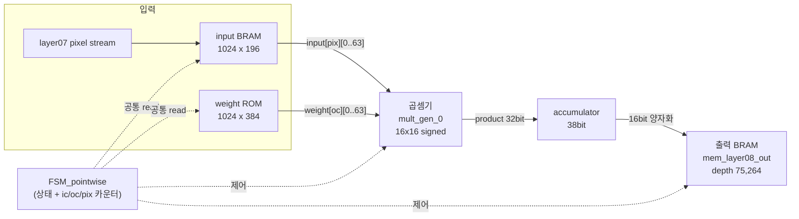
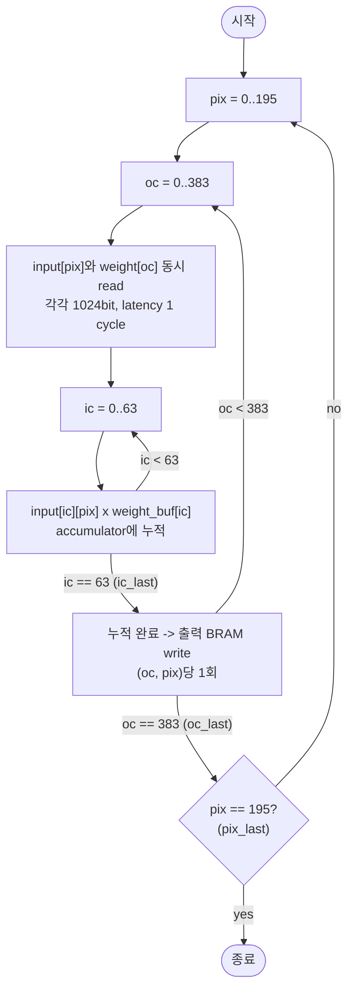
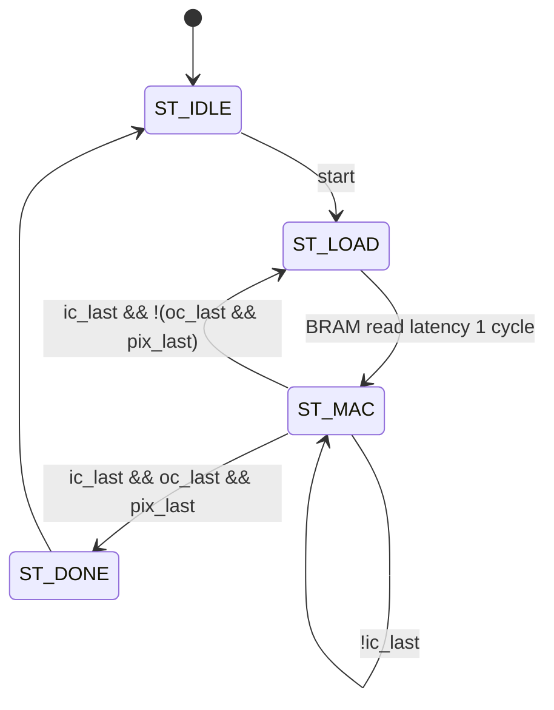

# pointwise 가속기 스펙

1x1 pointwise convolution(입력 채널 64개를 output channel별 가중치로 곱-누적해서 한 픽셀의 한 출력 채널 값을 만드는 연산)을 수행하는 하드웨어 가속기.

입력과 weight는 각각 1024-bit BRAM 한 주소에 채널 64개의 16-bit 값을 저장한다.

## 개요



흐름: 각 `(pix, oc)`마다 **input과 weight를 같은 `mem_read_req`로 동시에 읽고 → 64개 채널을 곱-누적 → Q2.13으로 변환 → 출력 BRAM에 저장**한다.

입력 BRAM은 `input_layer08.coe`, weight ROM은 `weight_layer08.coe`로 초기화된다. `pointwise` 내부에서 input BRAM write interface를 비활성화했으므로, reset 해제 후 `start` 한 클럭 펄스만 주면 고정 입력에 대한 전체 연산과 출력 read가 자동으로 진행된다.

## 파라미터 (`pointwise_pkg.sv`)

| 이름 | 값 | 의미 |
|---|---|---|
| `IN_CH` | 64 | 입력 채널 수 (안쪽 루프 `ic`) |
| `WEIGHT_WIDTH` | 384 | 출력 채널 수 (중간 루프 `oc`) |
| `CHANNEL_WIDTH` | 196 | 픽셀 수, 14x14 (바깥 루프 `pix`) |
| `WEIGHT_LENGTH` | 24,576 | 전체 가중치 개수 = `IN_CH x WEIGHT_WIDTH` |
| `PARALLEL_CH` | 64 | 한 클럭에 동시에 계산할 입력 채널 수 |

## 최상위 I/O (`pointwise` 모듈)

| 포트 | 방향 | 폭 | 설명 |
|---|---|---|---|
| `clk` | in | 1 | 클럭 |
| `rst` | in | 1 | 비동기 리셋 (active-high) |
| `start` | in | 1 | 연산 시작 트리거 |
| `done_w` | out | 1 | 75,264개 출력 write 완료 펄스 |
| `done_r` | out | 1 | 75,264개 출력 read 완료 펄스 |
| `data_out` | out | 16 | 출력 BRAM에서 읽은 값 |
| `output_data_valid` | out | 1 | `data_out`이 유효한 read cycle 표시 |

`pointwise`는 고정된 COE 입력으로 합성·구현 결과를 확인하는 최상위 모듈이다.
input BRAM의 외부 write interface는 내부에서 비활성화하고
`blk_mem_gen_input`에 설정된 `input_layer08.coe` 초기값만 사용한다.
기존 최상위 포트였던 `input_start_w`, `input_data[1023:0]`, `input_done_w`는
제거했으며, 별도의 `pointwise_top` wrapper 없이 `pointwise`를 직접 Top으로
사용한다. 이 구성은 1,024bit 입력이 물리 IO로 합성되는 것을 방지하지만,
실행 중 새로운 입력 데이터를 적재할 수 없는 COE 고정 입력 전용 구성이다.

## 연산 루프 구조



구체적인 주소 패턴 예시 (한 픽셀, oc=0에 대해):

```
[0][0][0] x weight[0][0]  ->  [1][0][0] x weight[0][1]  ->  [2][0][0] x weight[0][2]  ->  ...  ->  [63][0][0] x weight[0][63]
```
64개(`ic=0..63`)를 다 곱-누적하면 그 픽셀의 oc=0 출력 하나가 완성되어 BRAM에 write되고, 다음 `(input[pix], weight[oc])` 쌍을 동시에 읽는다. oc가 384개 다 끝나면 다음 픽셀로 넘어간다.

따라서 하나의 input pixel은 `oc=0..383` 동안 유지되고, `ic=63`까지 처리할 때마다 다음 output channel의 1024-bit weight word를 다시 읽는다. `ic=64..99` 같은 추가 곱셈 구간은 없다.

전체 반복 횟수: 곱셈은 `IN_CH x WEIGHT_WIDTH x CHANNEL_WIDTH = 64 x 384 x 196 = 4,816,896`회, 출력 write는 `WEIGHT_WIDTH x CHANNEL_WIDTH = 384 x 196 = 75,264`회.

## 모듈별 내부 구조

### FSM_pointwise — 제어 + 인덱스 카운터



| 포트 | 방향 | 폭 | 설명 |
|---|---|---|---|
| `clk`, `rst`, `start` | in | - | |
| `mem_read_req` | out | 1 | `ST_LOAD`에서 input/weight BRAM에 함께 인가 |
| `en_mul` | out | 1 | `cstate == ST_MAC`일 때 1 (조합 출력, 지연 없음) |
| `ic_cnt` | out | 6 | 0~63 |
| `oc_cnt` | out | 9 | 0~383 |
| `pix_cnt` | out | 8 | 0~195 |

`en_mul`이 1인 동안만 세 카운터가 증가한다. `ic_cnt`가 63에서 wrap될 때 다음 `ST_LOAD`로 이동해 갱신된 주소의 두 BRAM을 동시에 읽는다.

### mem_weight_in — 가중치 로더

`blk_mem_gen_0`은 1024-bit x 384 ROM이다. `start_r=mem_read_req`, `addra=oc_cnt`로 연결하며 한 주소에서 weight 64개를 한 번에 읽는다. 별도 burst counter나 `weight_ready`는 없다.

- 초기화 파일: `coe/weight_layer08.coe`
- 데이터 형식: signed Q1.15, 16bit x 64 channel/word
- 주소 매핑: address `oc` = 해당 output channel의 weight vector
- 비트 매핑: `weight[oc][0]`은 `[15:0]`, `weight[oc][63]`은 `[1023:1008]`

### mem_layer08_input_bram — 입력 BRAM

`blk_mem_gen_input`은 1024-bit x 196 Simple Dual Port RAM이다. Port A로 pixel vector를 적재하고 Port B에서 `start_r=mem_read_req`, `addrb=pix_cnt`로 읽는다. 별도 `input_ready`는 없다.

- 초기화 파일: `coe/input_layer08.coe`
- 데이터 형식: signed Q2.13, 16bit x 64 channel/word
- 주소 매핑: address `pix` = 해당 pixel의 input vector
- 비트 매핑: `input[pix][0]`은 `[15:0]`, `input[pix][63]`은 `[1023:1008]`

두 IP의 read 경로는 모두 primitive output register를 사용하지 않도록 맞춰져 있어 read latency가 동일하다. 특히 weight ROM의 `Register_PortA_Output_of_Memory_Primitives`는 `false`이다. 이 값이 `true`이면 weight가 input보다 한 클럭 늦어져 output channel 결과가 한 칸씩 밀린다.

### mult_gen_0 — 곱셈기 (Xilinx IP)

| 항목 | 값 |
|---|---|
| 입력 A, B | 16bit signed |
| 출력 P | 32bit signed |
| latency | 1클럭 (`PipeStages=1`, `C_LATENCY=1`) |

### pointwise_mac — 곱셈, 누적, 자리수 변환

별도 `accumulator` 모듈은 사용하지 않고 `pointwise_mac` 내부에서 처리한다. multiplier의 1클럭 latency에 맞춰 `en_mul`, 첫 채널 여부, 마지막 채널 여부를 각각 `en_mul_d`, `first_d`, `last_d`로 지연한다. 이 지연 신호와 product가 같은 사이클에 도착하므로 서로 다른 `(pix, oc)`의 결과가 섞이지 않는다.

각 product는 signed 32bit이고, `product_sum`과 `accumulator`는 signed 38bit이다. `first_d`에서 새 그룹의 첫 product로 accumulator를 덮어쓰고, 이후 product를 더한다. `last_d`에서는 마지막 product까지 포함한 `final_sum`을 만들고 결과를 한 번만 출력한다.

#### 고정소수점 계산

| 단계 | 형식 | 폭 | 계산 |
|---|---|---|---|
| input | signed Q2.13 | 16bit | COE 또는 input BRAM write 데이터 |
| weight | signed Q1.15 | 16bit | weight COE 데이터 |
| product | fractional bits 28 | 32bit | `Q2.13 x Q1.15` |
| accumulation | fractional bits 28 | 38bit | product 64개 합산, `32 + ceil(log2(64))` |
| output | signed Q2.13 | 16bit | `accumulated_q28 >>> 15`의 하위 16bit |

자리수 변환은 product마다 하지 않고 64개를 모두 38bit로 누적한 뒤 마지막에만 수행한다.

```systemverilog
final_sum = accumulator + product_sum;
result    = final_sum >>> (13 + 15 - 13);  // >>> 15
```

현재 구현은 단순화를 위해 반올림과 포화 처리를 하지 않는다. 산술 우측 시프트로 소수 비트를 버리고, 변환된 값이 signed 16bit 범위를 벗어나면 출력 BRAM에는 하위 16bit가 저장되어 wrap된다. bias, Batch Normalization, ReLU도 적용하지 않는다.

### mem_layer08_out — 출력 BRAM

| 포트 | 방향 | 폭 | 설명 |
|---|---|---|---|
| `clk`, `rst` | in | - | |
| `start_w` | in | 1 | write 트리거 펄스 |
| `dina` | in | 38 (signed) | MAC에서 Q2.13으로 변환된 결과; 하위 16bit 저장 |
| `data_out` | out | 16 | read 결과 |
| `data_valid` | out | 1 | `data_out` 유효 표시 |
| `done_w`, `done_r` | out | 1 | write/read 완료 |

- 깊이: `WEIGHT_WIDTH x CHANNEL_WIDTH = 75,264` (oc, pix 조합마다 1워드)
- `start_w`는 `pointwise_mac`의 `result_valid`에 직접 연결한다. 별도의 `write_delay` 시프트 레지스터는 사용하지 않는다.
- `QUANT_LSB=0`이며 출력 BRAM에서 별도의 자리수 변환은 하지 않는다.

## 파이프라인 타이밍

각 `(pix, oc)` 연산 시작 시점의 타이밍은 다음과 같다.

| 사이클 | 이벤트 |
|---|---|
| LOAD | 같은 `mem_read_req`와 현재 `pix_cnt`, `oc_cnt`를 두 BRAM에 인가 |
| 다음 MAC cycle | input/weight 1024-bit 출력이 함께 유효, `ic=0`부터 곱셈 시작 |
| 마지막 MAC 이후 | 마지막 product까지 포함한 합을 `>>> 15`하고 `result_valid`로 출력 BRAM write |

따라서 `input_ready`와 `weight_ready`를 따로 비교하지 않는다. 이 구조는 두 IP의 read latency 설정이 같다는 조건에 의존한다.

## 테스트벤치와 Vivado 설정

- simulation top: `tb_pointwise` (`tb_mem.sv` 안에 정의)
- input BRAM: `pointwise` 내부에서 write interface를 비활성화하고 COE 초기값 사용
- 시작 조건: reset 해제 후 `start`를 정확히 한 클럭만 인가
- 자동 확인: read 75,264회, `done_w`/`done_r` 각 1회, 출력 X/Z 없음
- 출력 기록: 유효한 `data_out`을 `pointwise_output.hex`에 순서대로 저장
- post-synthesis simulation에서도 사용할 수 있도록 `output_data_valid`를 최상위 출력 포트로 연결
- timeout: FSM이 멈춰도 무한 시뮬레이션이 되지 않도록 전체 예상 연산량 기준 watchdog 사용
- XSim runtime: `all`로 설정되어 테스트벤치의 `$finish`까지 실행
- 사용하지 않는 `simple_dual_ram2.sv`는 Vivado project fileset에서 제거됨
- `blk_mem_gen_input`과 `blk_mem_gen_0`의 COE 초기화가 활성화되어 있음

수치 기준값은 다음 식으로 계산한다. `signed16`은 결과의 하위 16bit를 취하는 현재 wrap 동작을 뜻한다.

```text
expected[pix][oc] = signed16(
    sum(ic=0..63, signed16(input[pix][ic]) * signed16(weight[oc][ic])) >>> 15
)
```

## 현재 구현 상태

- `pointwise` 자체를 COE 고정 입력용 최상위 모듈로 변경 완료
- `input_start_w`, `input_data[1023:0]`, `input_done_w` 외부 포트 제거 완료
- input BRAM write interface를 내부에서 `start_w=0`, `dina=0`으로 고정 완료
- post-synthesis에서도 결과 유효 신호를 확인하도록 `output_data_valid` 최상위 출력 연결 완료
- input/weight 공통 read 제어와 input, weight, output BRAM IP 연결 완료
- `ic=0..63` 완료마다 다음 `oc` weight를 읽는 `pix -> oc -> ic` 루프 구현 완료
- multiplier latency에 맞춘 MAC 제어 지연 및 38bit 누적 구현 완료
- 최종 누적값의 Q2.13 변환(`>>> 15`) 구현 완료
- 테스트벤치의 COE 기반 입력, start pulse, read 결과 개수·완료 펄스·X/Z 자동 검사 구현 완료
- Vivado 2020.2 compile 및 static elaboration 통과
- 전체 functional simulation 통과: write/read 각 75,264회, `done_w`/`done_r` 각 1회, X/Z 0개
- `pointwise_output.hex` 75,264개를 COE 기준 정수식과 전수 비교했으며 mismatch 0개 확인
